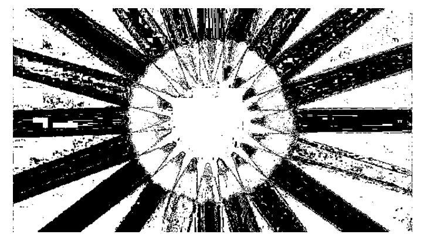

= Bayesian Sınıflandırma 

== 1) İçindekiler
. İçindekiler
. Versiyon Geçmişi
. Giriş
. Bayesian Sınıflandırma
. Sonuçlar
. Referanslar

== 2) Versiyon Geçmişi

|===
|Tarih|Değişiklik|Kişi

|07.01.2017
|Bayesian ile Görüntü Yumuşatma

|Gönül Toktay
|07.01.2017
 
|Bayesian ile Görüntü Yumuşatma
|M.Sıla Genç

|30.01.2017

|Düzenleme
|Merve Tafralı

|===

== 3) Giriş

Görüntülerdeki gölgeler,görüntü kalitesinin azalmasına sebep olmaktadır. Bu sebepten ötürü gölgelerin belirlenerek yumuşatılması gerekebilmektedir.
Gölgenin belirlenmesi için Bayesian sınıflandırma algoritmasından yararlanılacaktır. Sınıflandırma algoritması görüntü işleme kapsamında Python programlama kullanılarak 
örneklenmeye çalışılacaktır. +

== 4) Bayesian Sınıflandırması
Sınıflandırmanın genel amacı bir nitelik değerini,diğerlerini kullanarak belirlemektir http://web.itu.edu.tr/~sgunduz/courses/verimaden/slides/d3.pdf[[1]]. Veri dağılımına göre bir model elde edilir. Elde edilen bu model başarımı belirlendikten sonra niteliğin bilinmeyen değerini tahmin etmek için kullanılır   https://tr.wikipedia.org/wiki/Naive_Bayes_s%C4%B1n%C4%B1fland%C4%B1r%C4%B1c%C4%B1[[2]]. 
Bayes sınıflandırmasında; +
Niteliklerin hepsi aynı derecede önem sahibi +
Nitelikler birbirlerinden bağımsızdır; yani bir nitelik değeri diğer bir nitelik değeri hakkında bilgi içermemektedir http://www.acikders.org.tr/pluginfile.php/645/mod_resource/content/0/Ek_Kaynaklar/siniflandirma.pdf[[3]]. +
Çalışmada kullanılacak sınıflandırma renkler üzerinden gerçekleştirilecektir. Piksel değerinin gölge olarak nitelendirilmesi için o pikselin ve  genel görüntü üzerinde yapılacak olasılık işlemklerinin sonuclarına göre karar verilecektir. +

== 6)  Sonuçlar

1.Orjinal Görüntü

2.Bayes Sınıflandırma Sonrasındaki Görüntü

== 7)Referanslar
. http://web.itu.edu.tr/~sgunduz/courses/verimaden/slides/d3.pdf
. https://tr.wikipedia.org/wiki/Naive_Bayes_s%C4%B1n%C4%B1fland%C4%B1r%C4%B1c%C4%B1
. http://www.acikders.org.tr/pluginfile.php/645/mod_resource/content/0/Ek_Kaynaklar/siniflandirma.pdf
. http://www.slideshare.net/talhakabakus/grnt-ilemede-makine-renme-teknikleri
. http://www.teknolojikarastirmalar.com/pdf/tr/02_2013_8_1_145_834.pdf

